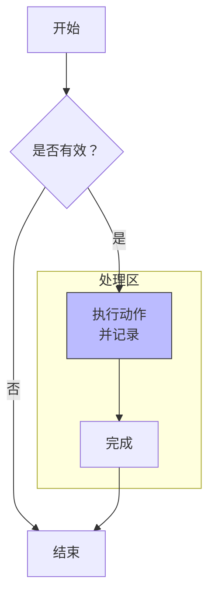

# Mermaid 图表生成规则（版本 9.1.3）

当你需要生成 Mermaid 图表时，必须严格遵循以下规则，以确保图表能够被 Mermaid 9.1.3 正确渲染，不出现 `Syntax error in graph` 错误。

## 1. 图表类型声明
- 所有图表必须以有效的类型关键字开头，后跟方向或配置。
- 支持的图表类型（9.1.3）：
  - `graph` （流程图，旧版语法）
  - `flowchart` （流程图，新版语法，9.1.3 中支持但部分高级特性可能不稳定，优先使用 `graph`）
  - `sequenceDiagram`
  - `classDiagram`
  - `stateDiagram`
  - `erDiagram`
  - `journey`
  - `gantt`
  - `pie`
  - `gitGraph`
- **示例**：
    ```mermaid
      graph TD
    ```

## 2. 节点与连接

### 2.1 节点形状

- 矩形：`[文本]`
- 圆角矩形：`(文本)`
- 圆形：`((文本))`
- 菱形：`{文本}`
- 六边形：`{{文本}}`
- **若文本中包含空格、标点符号或非ASCII字符，必须用双引号包裹**：
  ```mermaid
      A["包含空格和标点！"]
  ```

### 2.2 连接线

- 实线箭头：`-->`
- 实线无箭头：`---`
- 带文本的实线箭头：`-- 文本 -->` 或 `-->|文本|`
- 虚线箭头：`-.->`
- 虚线无箭头：`.-`
- 带文本的虚线箭头：`-. 文本 .->`

**注意**：

- 禁止使用单短横线或单箭头 `-` `->`，它们是无效语法。
- 连接线两端必须与节点 ID 之间用空格隔开。

### 2.3 节点 ID 命名

- 只允许字母、数字、下划线，必须以字母开头。
- 示例：`StartNode`, `node_1`, `processA`。

## 3. 子图（subgraph）

语法严格遵循：

```mermaid
subgraph 标题
    节点定义...
end
```

- `subgraph` 与标题之间至少一个空格。
- 子图内语句必须缩进（使用空格，禁止 Tab）。
- 标题若含特殊字符，用双引号包裹，例如 `subgraph "我的子图"`。

## 4. 样式与类（适用于 graph/flowchart）

- 样式：`style 节点ID fill:#f9f,stroke:#333`
- 类：`classDef className fill:#f9f; class nodeId className`
- 类定义需在一行内完成。

## 5. 版本限制（9.1.3 不支持的特性）

以下语法在 9.1.3 中会出错，**不要使用**：

- `flowchart` 中的 `&` 并行连接。
- `---|文本|--->` 这种跨线文本（应使用 `-- 文本 -->`）。
- 节点文本中的 HTML 标签（如 `<br>`）可能不渲染，使用 `\n` 代替。
- 多行文本：部分形状支持 `<br>`，但推荐使用 `"Line1\nLine2"`。
- `mindmap` 图表类型（9.1.3 中不提供）。
- `quadrantChart` 图表类型。
- `sankey` 图表类型。

## 6. 完整示例（正确语法）



## 7. 代码块声明

在 Markdown 中，必须使用以下方式包裹图表：

````markdown
```mermaid
你的图表代码
```
````

## 8. 调试建议

- 若图表无法渲染，先尝试将 `flowchart` 改为 `graph`。
- 检查所有节点文本的双引号。
- 检查子图的 `subgraph` 和 `end` 是否配对。
- 检查连接线是否两边都有空格。

**请严格遵守以上规则，生成的 Mermaid 代码必须能通过 Mermaid 9.1.3 解析，不得出现任何 Syntax error。**

